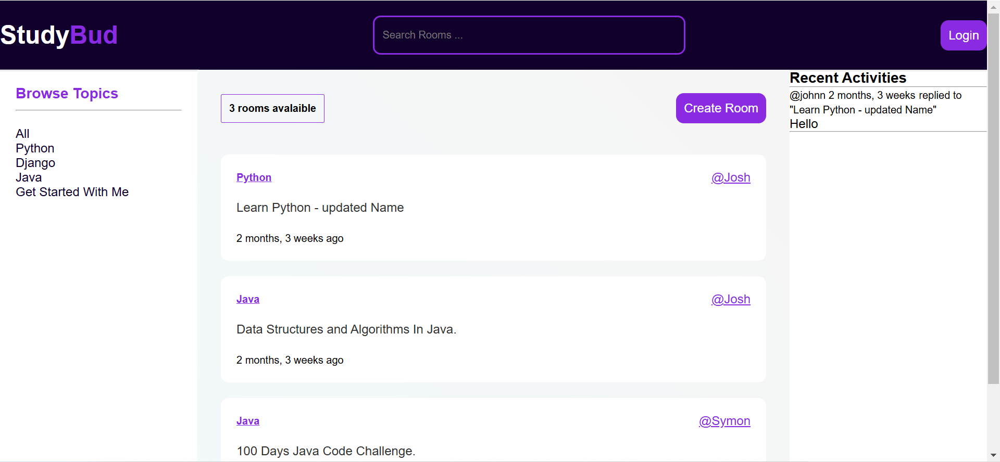

# StudyBud


## Getting Started 🔧

### Prerequisites
- Python 3.9+
- Django 4.x
- Git
### Installation Steps
1. Clone the repository:
    ```bash
    git clone https://github.com/john-ndichu-kimani/StudyBud.git
    cd StudyBud
    ```

2. Create and activate a virtual environment:
    ```bash
    python -m venv venv
    source venv/bin/activate  # On Windows: venv\Scripts\activate
    ```

3. Install dependencies:
    ```bash
    pip install -r requirements.txt
    ```

4. Apply database migrations:
    ```bash
    python manage.py migrate
    ```

5. Run the development server:
    ```bash
    python manage.py runserver
    ```

6. Open the app in your browser:
    ```
    http://127.0.0.1:8000
    ```


